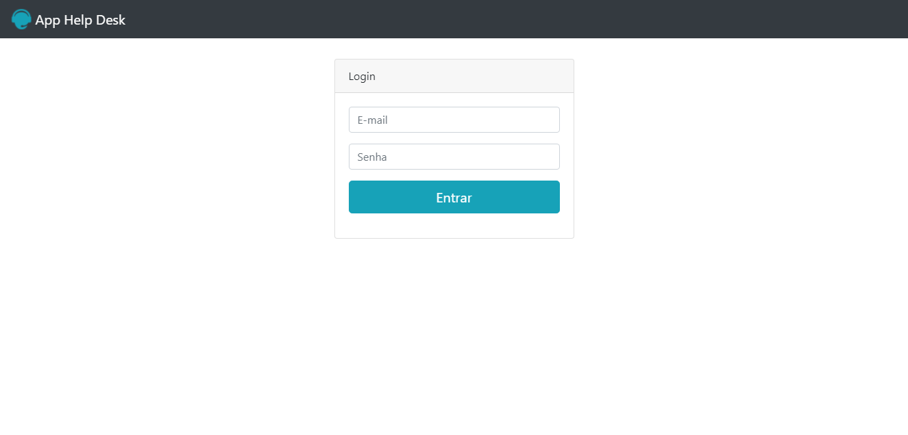

# Help_Desk

Aplicativo para abertura de chamados

Siga as instruções para o funcionamento do aplicativo: 
Utilizar um servidor para subir a aplicação;

Utilizar alguma das seguintes contas:
Sendo estes perfis administrativos:
email: adm@teste.com.br - senha: 1234
email: user@teste.com.br - senha: 1234

E estes usuários comuns:
email: jose@teste.com.br - senha: 1234
email: maria@teste.com.br - senha: 1234

A pasta 'privado' contém os arquivo que autentica os usuários e o 'arquivo.hd' que contém todos os chamados.
Para manter esses arquivos protegidos basta:
Colocar a pasta 'privado' fora do diretório público do servidor e;
No arquivo valida_login.php, na linha 2, ajustar o caminho para a pasta 'privado';
No arquivo registra_chamado.php, na linha 16, ajustar o primeiro parâmetro da função 'fopen' de acordo com o caminho para a pasta 'privado';
No arquivo consulta_chamado.php, na linha 9, ajustar o primeiro parâmetro da função 'fopen' de acordo com o caminho para a pasta 'privado'.
